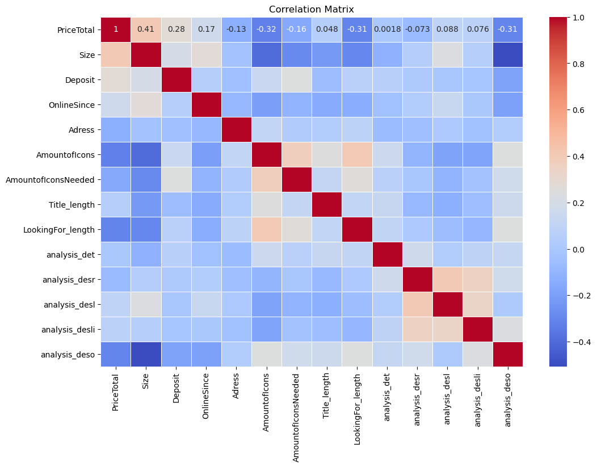
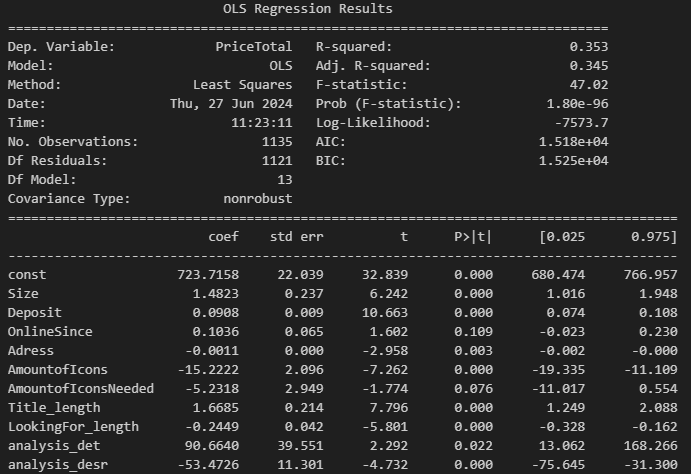
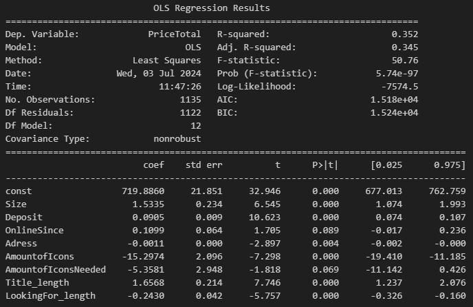
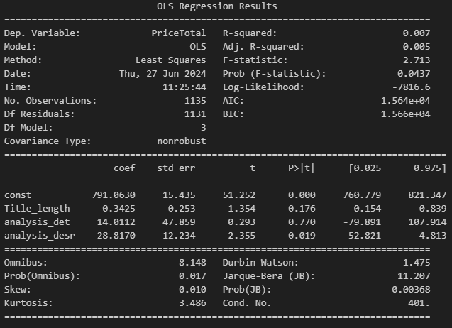

## Regression Analysis Results

This file contains the regression analysis results of the wggesucht.de scraping procedure featured in the rest of the project.

I have performed a comprehensive analysis to understand the relationship between various factors and the rental prices of apartments. The results provide valuable information for understanding the housing market dynamics and making informed decisions.

Let's dive into the regression analysis results and explore the significant variables, coefficients, and statistical measures that contribute to our understanding of apartment rental prices.

# Prerequisites for the regression approach

- a set of variables scraped on the wggesucht.de website
- a set dependend variable called 'Total Price' (monthly rent price of an given apartment)

# my approach

I started my regression analysis with a correlation matrix. The correlation matrix helps to identify the relationships between the variables and the dependent variable. By examining the correlation coefficients, we can gain insights into which variables are strongly correlated with the rental prices of apartments. This initial step allows us to understand the potential predictors and select the most relevant variables for our regression model.

## Size of Apartment as a strong Predictor 
(in source rooms of houses: (vgl. Zhang 2021, S. 6f))

Initial Estimate: Size correlates positively.
Analysis: After conducting the correlation analysis, it was found that the size of an apartment is the most significant predictor and relevant variable in determining the rental price. The size of an apartment has a strong positive correlation (0.41) with the monthly rent price. 

To further explore this relationship, a regression model was built using the size of the apartment as the independent variable and the rental price as the dependent variable. The regression analysis revealed a significant coefficient for the size variable, indicating that for every unit increase in apartment size, there is a corresponding increase in the rental price.

This finding suggests that the size of an apartment plays a crucial role in determining its rental price. Prospective tenants and landlords can use this information to make informed decisions about pricing and negotiating rental agreements.

Although there is an obvious correlation between price and size, the models fit, which isn't optimal, indicates that there are more variables explaining the rent price of an apartment.

## Deposit as a Predictor

Initial Estimate: Deposit correlates positively.
Analysis: A higher deposit often signals a more valuable property. Landlords typically require a larger deposit for more expensive apartments as a form of security. Hence, apartments with a higher deposit are likely to have a higher monthly rent, reflecting their overall higher value.

## OnlineSince as a Predictor

Initial Estimate: OnlineSince correlates positively.
Analysis: The duration an apartment listing has been online can be an indicator of its pricing strategy. Apartments that remain listed for longer periods may be priced higher than the market average, causing them to remain unleased. Conversely, apartments that are well-priced or offer good deals tend to be rented quickly, reducing their online duration.

## Address as a Predictor

Initial Estimate: Address correlates positively.
Analysis: The address of an apartment is a crucial determinant of its price. Apartments located in more desirable or affluent areas of Munich are typically more expensive. The quality of the neighborhood, proximity to amenities, and overall attractiveness of the location are reflected in the rent prices. (https://suedbayerische-immobilien.de/Mietpreise-Muenchen-Stadtteile)

## Amount of Icons/Title Length as a Predictor

Initial Estimate: These might correlate positively.
Analysis: The length and detail of the advertisement's title and the number of icons can indicate the level of effort the author put into creating the listing. (vgl. outbrain o.J., o.S.) A more detailed and elaborate advertisement might suggest that the landlord or agent is more professional and is potentially charging a premium. It could also imply that the property is well-maintained and worth the higher price.

## LookingFor Length as a Predictor

Initial Estimate: This might be correlated negatively.
Analysis: A longer "LookingFor" section could indicate that the landlord has specific requirements or restrictions for potential tenants. This can limit the pool of applicants, potentially leading to lower demand and thus a lower price. Detailed restrictions might discourage prospective tenants, necessitating a reduction in price to attract interest.

## Sentiment Analysis of Description Texts as a Predictor

Initial Estimate: This should correlate positively.
Analysis: The sentiment of the description text can reflect the quality and attractiveness of the apartment. Positive and engaging descriptions often indicate that the landlord has put considerable effort into presenting the apartment favorably. This effort typically correlates with a higher perceived value and, consequently, a higher price. In the source I conducted for an understanding of sentiment analysis of textes, they used it to review coronavirus related sentiments in a well documented way. I used this literature to review the description textes given on the wggesucht.de website. (vgl. Vishakha Arya et al. 2022, 45f)

## Conclusion

The variables included in the analysis, such as the size of the apartment, deposit amount, online duration, address, length of icons/title, length of the "LookingFor" section, and sentiment analysis of description texts, all have a strong reasoning to be included. Each variable offers unique insights into the pricing strategy, property value, demand, and overall attractiveness of the apartment.

By conducting a finer multiple regression analysis, we can further explore the relationships between these variables and the rental prices. This analysis will allow us to develop a more accurate predictive model for rent prices and identify valuable rental properties.

Overall, the regression analysis results and the inclusion of these variables have provided a solid foundation for understanding and predicting apartment rental prices. This information can be utilized by prospective tenants, landlords, and real estate professionals to make informed decisions and negotiate rental agreements effectively.

# The approach of finding the best model

## Default/Starter Model

The starter model is a regression model that includes all independent variables mentioned in the analysis. It has an R squared value of approximately 0.35, indicating that around 35% of the variation in rental prices can be explained by the included variables. This model serves as a baseline for further analysis and can be used to compare the performance of more refined models.

It is not always necessary or useful to include all independent variables in a regression model. Including irrelevant or weakly correlated variables can introduce noise and decrease the model's predictive power. 

By selecting only the most significant variables, you can create a more parsimonious and interpretable model. This approach improves the model's performance and reduces the risk of overfitting.

Remember to assess the statistical significance and practical relevance of each variable before including it in the final model. It's important to strike a balance between simplicity and explanatory power when selecting independent variables for regression analysis.

*I would like to play a bit with the models specification in order to possibly achive a "better" model - e.q. having more explanatory power or only a marginal loss of explainitory power while beeing more simplistic*

## AIC based model

This model specified in the regression analysis AIC part is striving to be the model with the lowest AIC which is then the model with the best ratio of having a good explanatory value, but also being the most simplistic in that regard. 

The AIC (Akaike Information Criterion) is a statistical measure used in regression analysis to evaluate and compare different models. It provides a way to balance the trade-off between model complexity and goodness of fit.

The AIC value is calculated based on the log-likelihood of the model and the number of parameters used in the model. The log-likelihood measures how well the model fits the data, while the number of parameters represents the complexity of the model. 

The goal of the AIC is to find the model that has the best balance between explanatory power and simplicity. A lower AIC value indicates a better model fit, meaning it explains the data well while using fewer parameters. On the other hand, a higher AIC value suggests a less optimal model fit, indicating either overfitting (using too many parameters) or underfitting (using too few parameters).

By comparing the AIC values of different models, you can determine which model is the most suitable for your data. The model with the lowest AIC value is considered the best-fitting model among the alternatives being compared. (vgl. Cavanaugh und Neath 2019, S. 2ff)

It's important to note that the AIC is a relative measure, meaning it is used for model comparison rather than providing an absolute measure of model quality. It helps you select the model that strikes the right balance between complexity and explanatory power for your specific analysis. 

*The key finding of the analysis is that the best model based on the AIC value is the same as the default or starter model, which includes all the independent variables mentioned in the analysis. This means that including all the variables provides the best balance between explanatory power and simplicity, according to the AIC criterion.*

By including all the relevant variables, we can capture the most significant factors that contribute to the variation in rental prices. This comprehensive model allows us to make accurate predictions and understand the underlying dynamics of the housing market.
It's important to note that while including all variables may increase the complexity of the model, it also ensures that we don't miss out on any important predictors. This approach provides a robust and reliable model for analyzing and predicting apartment rental prices.
Overall, the best model based on the AIC value is the same as the default or starter model, which includes all the independent variables. This model strikes the right balance between explanatory power and simplicity, making it the most suitable choice for predicting rental prices.

## My own Model approach based on a algorithm which punishes marginal gains in R^2 for added complexity

In my own algorithm, I aim to strike a balance between model complexity and explanatory power by penalizing the addition of variables that do not significantly increase the R^2 value. The algorithm considers every combination of independent variables and evaluates their impact on the R^2.

The algorithm starts with a baseline model that includes no independent variables. It then iteratively adds one variable at a time and calculates the change in R^2. If the increase in R^2 is less than 0.02, the variable is penalized and not included in the final model.

This approach ensures that only variables with a substantial impact on the R^2 are included in the model, while minimizing unnecessary complexity. By penalizing the addition of variables that do not significantly improve the model's explanatory power, we can create a more parsimonious and interpretable model.

The final model obtained through this algorithm provides a good balance between simplicity and explanatory power, making it a valuable tool for predicting rental prices.

## Remarks on my approaching to find the best models

I was able to use a more experimental approach due to the fact that all indepentend variables carry a good reason to be included in the analysis. Since wggesucht.de only has a set amount of details which could be scraped from I operated in this scope in order to find the best fitting model.

## Results

Based on the results of iterating over combinations of independent variables, three models were evaluated:

1. Model 1 (Default): This model includes all the independent variables mentioned in the analysis, such as 'Size', 'Deposit', 'OnlineSince', 'Adress', 'AmountofIcons', 'AmountofIconsNeeded', 'Title_length', 'LookingFor_length', 'analysis_det', 'analysis_desr', 'analysis_desl', 'analysis_desli', and 'analysis_deso'. The R^2 value for this model is 0.353.

2. Model 2 (AIC): This model is based on the AIC criterion and also includes all the independent variables mentioned in the analysis. The R^2 value for this model is 0.353.

3. Model 3 (Own approach): This model is based on an algorithm that penalizes the addition of variables that do not significantly increase the R^2 value. It includes 'Size', 'Deposit', 'OnlineSince', 'Adress', 'AmountofIcons', 'Title_length', 'LookingFor_length', 'analysis_det', and 'analysis_desr'. The R^2 value for this model is 0.344.

These models were evaluated to strike a balance between model complexity and explanatory power. The default and AIC models, which include all the variables, provide the best balance according to the AIC criterion. However, the own approach model, which includes a subset of variables, also shows promising results with a slightly lower R^2 value.

It's important to note that the choice of the best model depends on the specific goals and requirements of the analysis. The default and AIC models provide a comprehensive understanding of the factors influencing rental prices, while the own approach model offers a more simplified and interpretable model.

Based on the analysis, it appears that all the independent variables included in the regression model have a role in explaining the dependent variable. However, some variables, such as size, deposit, online duration, address, amount of icons, title length, looking for length, and sentiment analysis of description texts, have a higher impact on the explanatory power of the model. These variables provide valuable insights into the pricing strategy, property value, demand, and overall attractiveness of the apartment.

## Further validation of the models

After evaluating each model I undermined them (Model 1 & Model 3 - not Model 2 because its the same as 1) all steps of checks of assumptions of regression analysis. The results can be found in the file 'regression_analysis_r_squared'.

## Limitation of this Research/Regression Analysis

While the regression analysis provides valuable insights into the factors influencing apartment rental prices, it is important to acknowledge that there are other determinants and economic concepts that can also have an influence. Some of these factors include:

Some other Ideas based on DB Research 2023 (vgl. Jochen Möbert 2023, 1ff) - Those are relevant for understanding the general concept of rent fluctuation but in the context of the task there are only a few which could be accplicable:

**Fundamental Supply Shortage:** A primary driver of housing prices is the imbalance between supply and demand. Many cities experience higher demand than supply, which puts upward pressure on prices. This shortage is expected to persist in many metropolitan areas for several years . => observe the demand and supply over a longer timeframe

**Interest Rates:** The cost of borrowing money to buy homes significantly impacts housing prices. Higher interest rates increase mortgage costs, which can suppress housing demand and lead to lower prices. Conversely, lower interest rates make borrowing cheaper, potentially increasing demand and pushing prices up .

**Inflation Protection:** In times of high inflation, real estate is often seen as a good investment because property values tend to increase faster than inflation. This can drive up housing prices as investors seek to protect their assets against inflation .

**Regulatory Environment:** Strict rent controls and housing regulations can limit rent increases. However, the rise in short-term rentals, furnished rentals, and the prevalence of index-linked leases can still drive rent growth despite regulatory constraints .

**Population Growth and Migration:** Population increases, especially due to immigration, add to housing demand. This is particularly relevant in cities experiencing high influxes of people, such as refugees, which further exacerbates the supply shortage and drives up prices .

**Economic Conditions:** The broader economic environment, including employment rates and income levels, also influences housing demand. Higher incomes can lead to higher housing prices as more people can afford to buy homes .

**Geographical and Climatic Factors:** Regions less affected by extreme weather events or those with desirable climate conditions can see higher demand and prices for housing. This is becoming increasingly relevant as the impacts of climate change become more pronounced .

Here are the ones which could have been on intrest:

**(relevant) Construction Costs:** Rising costs of labor and materials can increase the cost of building new homes, which can be passed on to buyers, thus increasing housing prices. Conversely, a decline in construction activity due to high costs can exacerbate supply shortages .

**(relevant) Energy Efficiency and Emission Standards:** Properties with lower emissions or higher energy efficiency can command price premiums. The increasing focus on sustainability and regulatory requirements for energy-efficient buildings can lead to higher prices for such properties .

**Problem:** I wasn't sure how to determine which adverts are about newly constructed apartments => Maybe a textual analysis of the description with a keyword filter like ("Neubau", ...). Since construction prices rose lately those apartments might correlate with higher price premiums. New Energy Efficency standards as well as the increase of energy (heating, etc.) is also a reason why consumers favour newer apartment over older ones. therefore a certain prices premium might be a result of the market, but ultimatly I wasn't sure on how to discover if an advert on wggesucht.de has a certain energy grade. (NLP of the description could be a brief idea)

## Conclusion

In conclusion, the regression analysis results provide valuable insights into predicting apartment rental prices. The AIC criterion helps in selecting the best model that strikes a balance between complexity and explanatory power. The default model, which includes all independent variables, proves to be the most suitable choice according to the AIC value. However, an alternative approach using an algorithm that penalizes the addition of variables with marginal gains in R^2 also shows promising results with a slightly lower R^2 value.

It's important to note that the choice of the best model depends on the specific goals and requirements of the analysis. The default and AIC models provide a comprehensive understanding of the factors influencing rental prices, while the own approach model offers a more simplified and interpretable model.

Further validation of the models through checks of assumptions of regression analysis has been conducted, and the results can be found in the file 'regression_analysis_r_squared'.

However, it's crucial to acknowledge the limitations of this research. While the regression analysis provides valuable insights, there are other determinants and economic concepts that can also influence apartment rental prices. Factors such as fundamental supply shortage, interest rates, inflation protection, regulatory environment, population growth and migration, economic conditions, geographical and climatic factors, construction costs, and energy efficiency and emission standards should be considered in a comprehensive analysis.

In conclusion, the regression analysis serves as a valuable tool for predicting rental prices, but it should be complemented with a broader understanding of the housing market dynamics and other relevant factors.